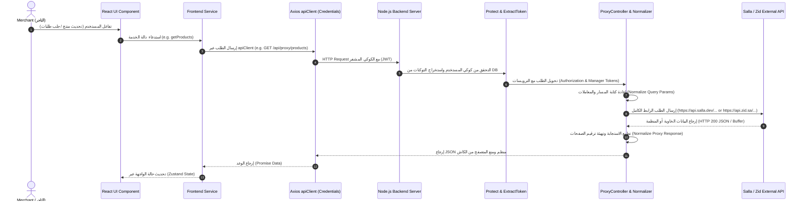

# T01: تقرير التوثيق الهندسي الشامل لجميع نقاط النهاية (API Endpoints Technical Report)

---

## 📋 فهرس المحتويات التنفيذي

1. [المقدمة والهيكلية المعمارية بالنظام (Architectural Overview)](#1-المقدمة-والهيكلية-المعمارية-بالنظام)
2. [مصفوفة ترويسات بروتوكول HTTP وآليات المصادقة (Auth & Headers Matrix)](#2-مصفوفة-ترويسات-بروتوكول-http-وآليات-المصادقة)
3. [التوثيق التفصيلي لنقاط مصادقة النظام والجلسات (Authentication & Session Endpoints)](#3-التوثيق-التفصيلي-لنقاط-مصادقة-النظام-والجلسات)
4. [التوثيق التفصيلي لنقاط ملف التاجر والمتجر الموحد (Merchant & Store Profile Endpoints)](#4-التوثيق-التفصيلي-لنقاط-ملف-التاجر-ومتجر-الموحد)
5. [التوثيق التفصيلي لنقاط الرفع المباشر للملفات والصور (Direct Upload Endpoints)](#5-التوثيق-التفصيلي-لنقاط-الرفع-المباشر-للملفات-والصور)
6. [التوثيق التفصيلي لنقاط المنتجات الشاملة (Products Endpoints)](#6-التوثيق-التفصيلي-لنقاط-المنتجات-الشاملة)
7. [التوثيق التفصيلي لنقاط خيارات ومتغيرات المنتجات (Product Options & Variants Endpoints)](#7-التوثيق-التفصيلي-لنقاط-خيارات-ومتغيرات-المنتجات)
8. [التوثيق التفصيلي لنقاط صور المنتجات (Product Images Endpoints)](#8-التوثيق-التفصيلي-لنقاط-صور-المنتجات)
9. [التوثيق التفصيلي لنقاط صفات وشارات ومستودعات المتجر (Store Attributes & Badges Endpoints)](#9-التوثيق-التفصيلي-لنقاط-صفات-وشارات-ومستودعات-المتجر)
10. [التوثيق التفصيلي لنقاط الأقسام والتصنيفات (Categories Endpoints)](#10-التوثيق-التفصيلي-لنقاط-الأقسام-والتصنيفات)
11. [التوثيق التفصيلي لنقاط إدارة الطلبات (Orders Endpoints)](#11-التوثيق-التفصيلي-لنقاط-إدارة-الطلبات)
12. [التوثيق التفصيلي لنقاط إدارة العملاء (Customers Endpoints)](#12-التوثيق-التفصيلي-لنقاط-إدارة-العملاء)
13. [مخطط سير البيانات والتنفيذ (Sequence Diagram & Workflow)](#13-مخطط-سير-البيانات-والتنفيذ)
14. [فهرس المراجع والملفات في المشروع (Project File Index)](#14-فهرس-المراجع-والملفات-في-المشروع)

---

## 1. المقدمة والهيكلية المعمارية بالنظام

يعتمد مشروع لوحة تحكم المتاجر الموحدة (Project Dashboard) على نمط **BFF (Backend For Frontend)** المُقترن بمحرك توجيه وحاضن بروكسي ديناميكي (Dynamic Proxy Gateway). 

تتمحور وظيفة الخادم المساعد (Node.js Express Server) حول توحيد الواجهات للفرونت إند (React Enterprise Application)، مع تكفل الباك إند بالتحويل التلقائي والدقيق للطلبات نحو منصة **سلة (Salla)** أو منصة **زد (Zid)** حسب المنصة التي ينتمي إليها حساب التاجر المسجل.

```
┌─────────────────────────────────────────────────────────────────────────┐
│                        React Enterprise Frontend                        │
│                (Vite + React Router + Zustand + Axios)                  │
└────────────────────────────────────┬────────────────────────────────────┘
                                     │
                                     │ (HTTP Requests with Credentials Cookie)
                                     ▼
┌─────────────────────────────────────────────────────────────────────────┐
│                     Node.js / Express Backend (BFF)                     │
│  - JWT Middleware Auth Verification (protect)                           │
│  - Store Token Extraction & Automatic Refresh (extractShopToken)       │
│  - Path Traversal & SSRF Whitelist Security Checking                   │
│  - Query Parameter & Response Body Normalization Engine                 │
└───────────────────┬─────────────────────────────────┬───────────────────┘
                    │                                 │
   (Salla Platform) │                                 │ (Zid Platform)
                    ▼                                 ▼
┌───────────────────────────────────────┐ ┌───────────────────────────────────────┐
│         Salla REST API v2             │ │          Zid REST API v1              │
│ Auth: https://accounts.salla.sa       │ │ Auth: https://oauth.zid.sa            │
│ Core: https://api.salla.dev/admin/v2  │ │ Core: https://api.zid.sa/v1           │
└───────────────────────────────────────┘ └───────────────────────────────────────┘
```

---

## 2. مصفوفة ترويسات بروتوكول HTTP وآليات المصادقة

تختلف الترويسات (HTTP Headers) المطلوبة عند معالجة طلبات المنصتين بشكل جوهري:

### أ. منصة سلة (Salla Platform Credentials):
* **Bearer Token**: يُرسل في ترويسة `Authorization: Bearer {SALLA_ACCESS_TOKEN}`.
* **Accept Header**: `Accept: application/json`.
* **Token Lifetime**: 14 يوم (مع إمكانية التجديد الآلي عبر Refresh Token).

### ب. منصة زد (Zid Platform Credentials):
* **Authorization Header**: `Authorization: Bearer {ZID_AUTHORIZATION_TOKEN}` (يُستخدم للتفويض العام).
* **Manager Token Header**: `X-Manager-Token: {ZID_ACCESS_TOKEN}` و `Access-Token: {ZID_ACCESS_TOKEN}` (إجباري لعمليات الإدارة والتعديل).
* **Store ID Header**: `Store-Id: {PLATFORM_STORE_ID}`.
* **Role Header**: `Role: Manager`.
* **Accept Language**: `Accept-Language: ar`.

---

## 3. التوثيق التفصيلي لنقاط مصادقة النظام والجلسات

### 3.1. جلب بيانات التاجر الحالي (Get Current User Session)
* **المسار المحلي بالفرونت إند (Frontend Local URL)**: `http://localhost:3000/api/auth/me`
* **المسار الخارجي للمنصة (Platform URL)**: غير متاح (نقطة داخلية محلية تعتمد على الجلسة المخزنة في قاعدة بيانات النظام).
* **طريقة الطلب (HTTP Method)**: `GET`
* **الميدل وير في الباك إند**: `protect`
* **ملف الفرونت إند المستدعي**: `frontend/src/features/auth/services/authService.ts`
* **دالة الفرونت إند**: `authService.getMe()`
* **دالة الباك إند المسؤول**: `authController.getMe` في `backend/src/controllers/authController.js`
* **الوظيفة الدقيقة**: قراءة كوكي الجلسة `jwt` المفكك وفحص التوكن المخزن، ثم إرجاع بيانات التاجر الأساسية (المعرف، البريد، اسم المتجر، المنصة النشطة).

### 3.2. إنهاء الجلسة وتسجيل الخروج (Merchant Logout)
* **المسار المحلي بالفرونت إند (Frontend Local URL)**: `http://localhost:3000/api/auth/logout`
* **المسار الخارجي للمنصة (Platform URL)**: لا يوجد (تدمير محلي للجلسة).
* **طريقة الطلب (HTTP Method)**: `POST`
* **الميدل وير في الباك إند**: بدون ميدل وير حماية (متاح للجميع لإلغاء الكوكي).
* **ملف الفرونت إند المستدعي**: `frontend/src/features/auth/services/authService.ts`
* **دالة الفرونت إند**: `authService.logout()`
* **دالة الباك إند المسؤول**: `authController.logout` في `backend/src/controllers/authController.js`
* **الوظيفة الدقيقة**: مسح كوكي الجلسة المشفر `jwt` المصدَر للمتصفح وتدمير حالة الجلسة بالكامل في خادم Express.

### 3.3. إعادة توجيه مصادقة سلة (Salla OAuth Redirect)
* **المسار المحلي بالفرونت إند (Frontend Local URL)**: `http://localhost:3000/auth/salla/redirect`
* **المسار الخارجي المولّد (Full Salla Generated OAuth URL)**:
  `https://accounts.salla.sa/oauth2/auth?response_type=code&client_id={SALLA_CLIENT_ID}&redirect_uri=http%3A%2F%2Flocalhost%3A3000%2Fauth%2Fsalla%2Fcallback&scope=offline_access%20read_products%20read_categories%20write_products%20write_categories&state={RANDOM_STATE_HEX}`
* **طريقة الطلب (HTTP Method)**: `GET`
* **الميدل وير في الباك إند**: `validatePlatform`, `oauthLimiter`
* **ملف الفرونت إند المستدعي**: `frontend/src/features/auth/services/sallaAuthApi.ts`
* **دالة الفرونت إند**: `getSallaOAuthUrl()`
* **دالة الباك إند المسؤول**: `authController.handleRedirect` & `SallaPlatform.generateAuthUrl`
* **الوظيفة الدقيقة**: توليد رابط مفتاح التفويض عبر سلة مع إنشاء قيمة `state` آمنة عشوائياً لمنع هجمات CSRF وتوجيه التاجر لتسجيل الدخول في حسابات سلة.

### 3.4. استقبال كود تفويض سلة (Salla OAuth Callback)
* **المسار المحلي بالفرونت إند (Frontend Local URL)**: `http://localhost:3000/auth/salla/callback`
* **المسار الخارجي للاستبدال (Full Salla Token Exchange URL)**:
  `https://accounts.salla.sa/oauth2/token`
* **طريقة الطلب (HTTP Method)**: `ALL` (`GET` / `POST`)
* **الميدل وير في الباك إند**: `validatePlatform`
* **ملف الفرونت إند المستدعي**: يتم التوجيه إليه تلقائياً من خوادم منصة سلة.
* **دالة الباك إند المسؤول**: `authController.handleCallback` & `SallaPlatform.exchangeCodeForTokens`
* **الوظيفة الدقيقة**: استقبال كود Authorization Code من سلة، وإرسال طلب خلفي لاستبداله بـ `access_token` و `refresh_token` وتخزين التوكن في قاعدة بيانات MySQL، وحفظ بيانات التاجر وإنشاء كوكي JWT للمستخدم.

### 3.5. إعادة توجيه مصادقة زد (Zid OAuth Redirect)
* **المسار المحلي بالفرونت إند (Frontend Local URL)**: `http://localhost:3000/auth/zid/redirect`
* **المسار الخارجي المولّد (Full Zid Generated OAuth URL)**:
  `https://oauth.zid.sa/oauth/authorize?response_type=code&client_id={ZID_CLIENT_ID}&redirect_uri=http%3A%2F%2Flocalhost%3A3000%2Fauth%2Fzid%2Fcallback&state={RANDOM_STATE_HEX}`
* **طريقة الطلب (HTTP Method)**: `GET`
* **الميدل وير في الباك إند**: `validatePlatform`, `oauthLimiter`
* **ملف الفرونت إند المستدعي**: `frontend/src/features/auth/services/zidAuthApi.ts`
* **دالة الفرونت إند**: `getZidOAuthUrl()`
* **دالة الباك إند المسؤول**: `authController.handleRedirect` & `ZidPlatform.generateAuthUrl`
* **الوظيفة الدقيقة**: إنشاء رابط OAuth لتفويض تطبيق منصة زد واستخراج قيمة state آمنة للتأكد من الموثوقية عند العودة.

### 3.6. استقبال كود تفويض زد (Zid OAuth Callback)
* **المسار المحلي بالفرونت إند (Frontend Local URL)**: `http://localhost:3000/auth/zid/callback`
* **المسار الخارجي للاستبدال (Full Zid Token Exchange URL)**:
  `https://oauth.zid.sa/oauth/token`
* **طريقة الطلب (HTTP Method)**: `ALL` (`GET` / `POST`)
* **الميدل وير في الباك إند**: `validatePlatform`
* **ملف الفرونت إند المستدعي**: يتم التوجيه إليه تلقائياً من خوادم منصة زد بعد موافقة التاجر.
* **دالة الباك إند المسؤول**: `authController.handleCallback` & `ZidPlatform.exchangeCodeForTokens`
* **الوظيفة الدقيقة**: استقبال كود التفويض من زد، واستبداله بـ Authorization Token للـ API و Access Token (Manager Token)، وتخزين التوكنات بقاعدة البيانات وتثبيت الجلسة للمستخدم.

### 3.7. فحص الجاهزية والاتصال بالخادم (Backend Health Check)
* **المسار المحلي (Local URL)**: `http://localhost:3000/health`
* **المسار الخارجي للمنصة (Platform URL)**: لا يوجد (فحص داخلي للباك إند).
* **طريقة الطلب (HTTP Method)**: `GET`
* **الميدل وير في الباك إند**: لا يوجد
* **دالة الباك إند المسؤول**: مسار مباشر في `backend/server.js` (السطر 83-100)
* **الوظيفة الدقيقة**: فحص حالة تشغيل خادم Express مع إجراء اختبار حقيقي للاتصال بقاعدة البيانات MySQL عبر Sequelize وتزويد الخادم بتوقيت النبضة (Heartbeat).

---

## 4. التوثيق التفصيلي لنقاط ملف التاجر والمتجر الموحد

### 4.1. جلب بروفايل التاجر من المنصة النشطة (Raw Merchant Profile)
* **المسار المحلي بالفرونت إند (Frontend Local URL)**: `http://localhost:3000/api/merchant/profile`
* **المسارات الخارجية للمنصات (Full Platform External URLs)**:
  * **سلة (Salla)**: `https://accounts.salla.sa/oauth2/user/info`
  * **زد (Zid)**: `https://api.zid.sa/v1/managers/account/profile`
* **طريقة الطلب (HTTP Method)**: `GET`
* **الميدل وير في الباك إند**: `protect`
* **ملف الفرونت إند المستدعي**: `frontend/src/features/dashboard/services/merchantService.ts`
* **دالة الفرونت إند**: `merchantService.getMerchantProfile()`
* **دالة الباك إند المسؤول**: `merchantController.getMerchantProfile`
* **الوظيفة الدقيقة**: جلب كائن البيانات الخام الخاص بالتاجر (الاسم، رقم الجوال، البريد، وتفاصيل الحساب) مباشرة من خوادم سلة أو زد حسب التوكن النشط.

### 4.2. جلب الملف الشامل والتفصيلي للمتجر الموحد (Unified Store Profile)
* **المسار المحلي بالفرونت إند (Frontend Local URL)**: `http://localhost:3000/api/store/store-profile` (مع دعم المعامل `?force=true`)
* **المسارات الخارجية للمنصات (Full Platform External URLs)**:
  * **منصة سلة (Salla)**:
    `https://api.salla.dev/admin/v2/store/info`
  * **منصة زد (Zid - يتم تنفيذ 5 استدعاءات بالتوازي معاً)**:
    1. `https://api.zid.sa/v1/managers/account/store`
    2. `https://api.zid.sa/v1/managers/account/store/branding`
    3. `https://api.zid.sa/v1/managers/account/store/social`
    4. `https://api.zid.sa/v1/managers/account/store/localization`
    5. `https://api.zid.sa/v1/managers/account/store/business`
* **طريقة الطلب (HTTP Method)**: `GET`
* **الميدل وير في الباك إند**: `protect`
* **ملف الفرونت إند المستدعي**: `frontend/src/features/store/services/storeProfileApi.ts`
* **دالة الفرونت إند**: `storeProfileApi.getStoreProfile()`
* **دالة الباك إند المسؤول**: `storeController.getStoreProfile`
* **الوظيفة الدقيقة**: تجميع وتطبيع (Normalize) بيانات المتجر الكاملة لتوحيد الهيكل المُرجع للفرونت إند بالكامل، وتشمل: اسم المتجر، النطاق، الأيقونة واللوجو، خطة الاشتراك، التراخيص التجارية، البيانات الضريبية، شبكات التواصل الاجتماعي، بيانات النشاط التجاري، واللغات والعملات.

---

## 5. التوثيق التفصيلي لنقاط الرفع المباشر للملفات والصور

### 5.1. رفع صورة منتج لمتجر زد (Zid Product Image Multipart Upload)
* **المسار المحلي بالفرونت إند (Frontend Local URL)**: `http://localhost:3000/api/upload/zid/products/:productId/images`
* **المسار الخارجي لمنصة زد (Full Zid External URL)**: `https://api.zid.sa/v1/products/:productId/images/`
* **طريقة الطلب (HTTP Method)**: `POST`
* **نوع المحتوى (Content-Type)**: `multipart/form-data`
* **الميدل وير في الباك إند**: `protect`, `extractShopToken`, `handleImageUpload` (باستخدام مكتبة Busboy/Multer)
* **ملف الفرونت إند المستدعي**: `frontend/src/features/products/services/productEditService.ts`
* **دالة الفرونت إند**: `productEditService.uploadProductImage(productId, formData, 'zid')`
* **دالة الباك إند المسؤول**: `uploadController.uploadZidProductImage`
* **الوظيفة الدقيقة**: استلام ملف الصورة كاملاً كتدفق (Binary Stream) من الفرونت إند وتمريره مباشرة لخوادم زد مع الترويسات المطلوبة لتجاوز قيود الـ Proxy العادي.

### 5.2. رفع صورة منتج لمتجر سلة (Salla Product Image Multipart Upload)
* **المسار المحلي بالفرونت إند (Frontend Local URL)**: `http://localhost:3000/api/upload/salla/products/:productId/images`
* **المسار الخارجي لمنصة سلة (Full Salla External URL)**: `https://api.salla.dev/admin/v2/products/:productId/images`
* **طريقة الطلب (HTTP Method)**: `POST`
* **نوع المحتوى (Content-Type)**: `multipart/form-data`
* **الميدل وير في الباك إند**: `protect`, `extractShopToken`, `handleImageUpload`
* **ملف الفرونت إند المستدعي**: `frontend/src/features/products/services/productEditService.ts`
* **دالة الفرونت إند**: `productEditService.uploadProductImage(productId, formData, 'salla')`
* **دالة الباك إند المسؤول**: `uploadController.uploadSallaProductImage`
* **الوظيفة الدقيقة**: استقبال ملف الصورة وإعادة تحويله بحقل `photo` كما تحتاجه منصة سلة وإرساله لـ API سلة v2 وتمرير الرد المنظم للفرونت إند.

---

## 6. التوثيق التفصيلي لنقاط المنتجات الشاملة

### 6.1. جلب قائمة المنتجات الفردية والجماعية (Fetch Products List)
* **المسار المحلي بالفرونت إند (Frontend Local URL)**: `http://localhost:3000/api/proxy/products`
* **المسارات الخارجية للمنصات (Full Platform External URLs)**:
  * **منصة سلة (Salla)**: `https://api.salla.dev/admin/v2/products`
  * **منصة زد (Zid)**: `https://api.zid.sa/v1/products/`
* **طريقة الطلب (HTTP Method)**: `GET`
* **الميدل وير في الباك إند**: `protect`, `extractShopToken`, `dynamicProxy`
* **ملفات الفرونت إند المستدعية**: 
  * `frontend/src/features/products/services/productService.ts`
  * `frontend/src/features/dashboard/services/dashboardService.ts`
* **الدوال في الفرونت إند**: `productService.getProducts()`, `dashboardService.fetchStats()`
* **الوظيفة الدقيقة والتطبيع**:
  * تحويل معاملات الاستعلام: لسلة تحول `page_size` إلى `per_page`؛ ولـ زد تحول `per_page` إلى `page_size` و `search` إلى `name`.
  * **معالجة الاستثناءات في الباك إند**: عند الاستعلام عن حالات `out_of_stock` في سلة يرجع الباك إند رد هادئ فارغ لتفادي خطأ 422؛ وعند تلقي خطأ 404 في زد بسبب عدم وجود منتجات يرجع الباك إند مصفوفة فارغة منظمة بحالة HTTP 200.

### 6.2. جلب بيانات منتج محدد بالـ ID (Fetch Single Product Details)
* **المسار المحلي بالفرونت إند (Frontend Local URL)**: `http://localhost:3000/api/proxy/products/:productId`
* **المسارات الخارجية للمنصات (Full Platform External URLs)**:
  * **منصة سلة (Salla)**: `https://api.salla.dev/admin/v2/products/:productId`
  * **منصة زد (Zid)**: `https://api.zid.sa/v1/products/:productId/`
* **طريقة الطلب (HTTP Method)**: `GET`
* **الميدل وير في الباك إند**: `protect`, `extractShopToken`, `dynamicProxy`
* **ملف الفرونت إند المستدعي**: `frontend/src/features/products/services/productService.ts` و `productEditService.ts`
* **الدوال في الفرونت إند**: `productService.getProductById()`, `productEditService.fetchProductBasicInfo()`
* **الوظيفة الدقيقة**: استرجاع كائن بيانات المنتج بالكامل شاملاً الأسعار، الوصف، الخيارات، والتصنيفات التابعة له.

### 6.3. تحديث بيانات المنتج الأساسية (Update Product Basic Info)
* **المسار المحلي بالفرونت إند (Frontend Local URL)**: `http://localhost:3000/api/proxy/products/:productId`
* **المسارات الخارجية للمنصات (Full Platform External URLs)**:
  * **منصة سلة (Salla - تستخدم PUT)**: `https://api.salla.dev/admin/v2/products/:productId`
  * **منصة زد (Zid - تستخدم PATCH)**: `https://api.zid.sa/v1/products/:productId/`
* **طريقة الطلب (HTTP Method)**: `PUT` (لسلة) / `PATCH` (لزد)
* **الميدل وير في الباك إند**: `protect`, `extractShopToken`, `dynamicProxy`
* **ملف الفرونت إند المستدعي**: `frontend/src/features/products/services/productEditService.ts`
* **دالة الفرونت إند**: `productEditService.updateProductBasicInfo()`
* **الوظيفة الدقيقة**: تعديل الحقول الأساسية للمنتج (الاسم، السعر، سعر التخفيض، SKU، الكمية، الحالة).

### 6.4. ربط منتج بقسم أو تصنيف محدد (Add Product to Category)
* **المسار المحلي بالفرونت إند (Frontend Local URL)**: `http://localhost:3000/api/proxy/products/:productId/categories`
* **المسارات الخارجية للمنصات (Full Platform External URLs)**:
  * **منصة سلة (Salla)**: `https://api.salla.dev/admin/v2/products/:productId/categories`
  * **منصة زد (Zid)**: `https://api.zid.sa/v1/products/:productId/categories/`
* **طريقة الطلب (HTTP Method)**: `POST`
* **جسم الطلب (Request Payload)**: `{ "id": categoryId }`
* **الميدل وير في الباك إند**: `protect`, `extractShopToken`, `dynamicProxy`
* **ملف الفرونت إند المستدعي**: `frontend/src/features/products/services/productEditService.ts`
* **دالة الفرونت إند**: `productEditService.addProductCategory()`
* **الوظيفة الدقيقة**: إضافة ربط للمنتج الحالي مع أحد أقسام المتجر التابعة له.

### 6.5. فصل منتج عن قسم محدد (Remove Product from Category)
* **المسار المحلي بالفرونت إند (Frontend Local URL)**: `http://localhost:3000/api/proxy/products/:productId/categories/:categoryId`
* **المسارات الخارجية للمنصات (Full Platform External URLs)**:
  * **منصة سلة (Salla)**: `https://api.salla.dev/admin/v2/products/:productId/categories/:categoryId`
  * **منصة زد (Zid)**: `https://api.zid.sa/v1/products/:productId/categories/:categoryId/`
* **طريقة الطلب (HTTP Method)**: `DELETE`
* **الميدل وير في الباك إند**: `protect`, `extractShopToken`, `dynamicProxy`
* **ملف الفرونت إند المستدعي**: `frontend/src/features/products/services/productEditService.ts`
* **دالة الفرونت إند**: `productEditService.removeProductCategory()`
* **الوظيفة الدقيقة**: حذف الربط القائم بين المنتج والتصنيف المحدد.

---

## 7. التوثيق التفصيلي لنقاط خيارات ومتغيرات المنتجات

### 7.1. جلب المتغيرات التابعة للمنتج - زد فقط (Fetch Product Variants)
* **المسار المحلي بالفرونت إند (Frontend Local URL)**: `http://localhost:3000/api/proxy/products/:productId/variants/`
* **المسار الخارجي لمنصة زد (Full Zid External URL)**: `https://api.zid.sa/v1/products/:productId/variants/`
* **طريقة الطلب (HTTP Method)**: `GET`
* **الميدل وير في الباك إند**: `protect`, `extractShopToken`, `dynamicProxy`
* **ملف الفرونت إند المستدعي**: `frontend/src/features/products/services/productEditService.ts`
* **دالة الفرونت إند**: `productEditService.fetchProductVariants()`
* **الوظيفة الدقيقة**: استرجاع مصفوفة المتغيرات المسجلة تحت منتج معين لمتجر زد.

### 7.2. إنشاء خيار مخصص جديد للمنتج (Create Product Option)
* **المسار المحلي بالفرونت إند (Frontend Local URL)**: `http://localhost:3000/api/proxy/products/:productId/options`
* **المسارات الخارجية للمنصات (Full Platform External URLs)**:
  * **منصة سلة (Salla)**: `https://api.salla.dev/admin/v2/products/:productId/options`
  * **منصة زد (Zid)**: `https://api.zid.sa/v1/products/:productId/options/`
* **طريقة الطلب (HTTP Method)**: `POST`
* **الميدل وير في الباك إند**: `protect`, `extractShopToken`, `dynamicProxy`
* **ملف الفرونت إند المستدعي**: `frontend/src/features/products/services/productEditService.ts`
* **دالة الفرونت إند**: `productEditService.createProductOption()`
* **الوظيفة الدقيقة**: إضافة سمة جديدة للمنتج (كاللون أو المقاس) مع توجيه الـ Payload حسب متطلبات سلة (كائن) وزد (مصفوفة).

### 7.3. إضافة قيمة خيار مخصصة - سلة فقط (Create Product Option Value)
* **المسار المحلي بالفرونت إند (Frontend Local URL)**: `http://localhost:3000/api/proxy/products/options/:optionId`
* **المسار الخارجي لمنصة سلة (Full Salla External URL)**: `https://api.salla.dev/admin/v2/products/options/:optionId`
* **طريقة الطلب (HTTP Method)**: `POST`
* **الميدل وير في الباك إند**: `protect`, `extractShopToken`, `dynamicProxy`
* **ملف الفرونت إند المستدعي**: `frontend/src/features/products/services/productEditService.ts`
* **دالة الفرونت إند**: `productEditService.createProductOptionValue()`
* **الوظيفة الدقيقة**: حقن قيمة مخصصة جديدة لخيار موجود مسبقاً برقم الـ Option ID.

### 7.4. حذف خيار منتج قائم (Delete Product Option)
* **المسار المحلي بالفرونت إند (Frontend Local URL)**: `http://localhost:3000/api/proxy/products/options/:optionId`
* **المسار الخارجي لمنصة سلة (Full Salla External URL)**: `https://api.salla.dev/admin/v2/products/options/:optionId`
* **طريقة الطلب (HTTP Method)**: `DELETE`
* **الميدل وير في الباك إند**: `protect`, `extractShopToken`, `dynamicProxy`
* **ملف الفرونت إند المستدعي**: `frontend/src/features/products/services/productEditService.ts`
* **دالة الفرونت إند**: `productEditService.deleteProductOption()`
* **الوظيفة الدقيقة**: حذف الخيار بالكامل ومسح كافة القيم والمتغيرات المرتبطة به.

### 7.5. إنشاء متغيرات فرعية جديدة للمنتج (Create Product Variants)
* **المسار المحلي بالفرونت إند (Frontend Local URL)**: `http://localhost:3000/api/proxy/products/:productId/variants`
* **المسارات الخارجية للمنصات (Full Platform External URLs)**:
  * **منصة سلة (Salla)**: `https://api.salla.dev/admin/v2/products/:productId/variants`
  * **منصة زد (Zid)**: `https://api.zid.sa/v1/products/:productId/variants/`
* **طريقة الطلب (HTTP Method)**: `POST`
* **الميدل وير في الباك إند**: `protect`, `extractShopToken`, `dynamicProxy`
* **ملف الفرونت إند المستدعي**: `frontend/src/features/products/services/productEditService.ts`
* **دالة الفرونت إند**: `productEditService.createProductVariant()`
* **الوظيفة الدقيقة**: توليد المتغيرات وتخصيص أسعار وكميات وأكواد SKU مستقلة لكل متغير.

### 7.6. تحديث بيانات متغير فرعي (Update Product Variant)
* **المسار المحلي بالفرونت إند (Frontend Local URL)**:
  * **لسلة**: `http://localhost:3000/api/proxy/products/variants/:variantId`
  * **لزد**: `http://localhost:3000/api/proxy/products/:productId/variants/:variantId`
* **المسارات الخارجية للمنصات (Full Platform External URLs)**:
  * **منصة سلة (Salla - تستخدم PUT)**: `https://api.salla.dev/admin/v2/products/variants/:variantId`
  * **منصة زد (Zid - تستخدم PATCH)**: `https://api.zid.sa/v1/products/:productId/variants/:variantId/`
* **طريقة الطلب (HTTP Method)**: `PUT` / `PATCH`
* **الميدل وير في الباك إند**: `protect`, `extractShopToken`, `dynamicProxy`
* **ملف الفرونت إند المستدعي**: `frontend/src/features/products/services/productEditService.ts`
* **دالة الفرونت إند**: `productEditService.updateProductVariant()`
* **الوظيفة الدقيقة**: تحديث بيانات متغير فردي (السعر، التخفيض، الوزن، كود المنتج).

### 7.7. حذف متغير فرعي للمنتج (Delete Product Variant)
* **المسار المحلي بالفرونت إند (Frontend Local URL)**: `http://localhost:3000/api/proxy/products/:productId/variants/:variantId`
* **المسارات الخارجية للمنصات (Full Platform External URLs)**:
  * **منصة سلة (Salla)**: `https://api.salla.dev/admin/v2/products/:productId/variants/:variantId`
  * **منصة زد (Zid)**: لا تحذف مباشرة بالـ DELETE بل تُحدث عبر `is_deleted: true`.
* **طريقة الطلب (HTTP Method)**: `DELETE`
* **الميدل وير في الباك إند**: `protect`, `extractShopToken`, `dynamicProxy`
* **ملف الفرونت إند المستدعي**: `frontend/src/features/products/services/productEditService.ts`
* **دالة الفرونت إند**: `productEditService.deleteProductVariant()`
* **الوظيفة الدقيقة**: إلغاء المتغير الفرعي نهائياً من قائمة متغيرات المنتج.

### 7.8. تحديث كميات المستودعات لمتغير سلة (Update Salla Variant Quantities)
* **المسار المحلي بالفرونت إند (Frontend Local URL)**: `http://localhost:3000/api/proxy/products/variants/:variantId/quantities`
* **المسار الخارجي لمنصة سلة (Full Salla External URL)**: `https://api.salla.dev/admin/v2/products/variants/:variantId/quantities`
* **طريقة الطلب (HTTP Method)**: `PUT`
* **الميدل وير في الباك إند**: `protect`, `extractShopToken`, `dynamicProxy`
* **ملف الفرونت إند المستدعي**: `frontend/src/features/products/services/productEditService.ts`
* **دالة الفرونت إند**: `productEditService.updateSallaVariantQuantities()`
* **الوظيفة الدقيقة**: تحديث توزيع الأعداد في المخازن والفروع المسجلة لمتغير سلة.

### 7.9. جلب أسباب تعديل الكميات - سلة فقط (Get Quantity Change Reasons)
* **المسار المحلي بالفرونت إند (Frontend Local URL)**: `http://localhost:3000/api/proxy/products/quantities/quantity-change-reason`
* **المسار الخارجي لمنصة سلة (Full Salla External URL)**: `https://api.salla.dev/admin/v2/products/quantities/quantity-change-reason`
* **طريقة الطلب (HTTP Method)**: `GET`
* **الميدل وير في الباك إند**: `protect`, `extractShopToken`, `dynamicProxy`
* **ملف الفرونت إند المستدعي**: `frontend/src/features/products/services/productEditService.ts`
* **دالة الفرونت إند**: `productEditService.getSallaQuantityChangeReasons()`
* **الوظيفة الدقيقة**: جلب الخيارات المعتمدة لتفسير تغيير الكمية (مثل جرد سنوي، تلف، بضاعة جديدة).

---

## 8. التوثيق التفصيلي لنقاط صور المنتجات

### 8.1. جلب قائمة صور المنتج - زد فقط (Fetch Product Images)
* **المسار المحلي بالفرونت إند (Frontend Local URL)**: `http://localhost:3000/api/proxy/products/:productId/images/`
* **المسار الخارجي لمنصة زد (Full Zid External URL)**: `https://api.zid.sa/v1/products/:productId/images/`
* **طريقة الطلب (HTTP Method)**: `GET`
* **الميدل وير في الباك إند**: `protect`, `extractShopToken`, `dynamicProxy`
* **ملف الفرونت إند المستدعي**: `frontend/src/features/products/services/productEditService.ts`
* **دالة الفرونت إند**: `productEditService.fetchProductImages()`
* **الوظيفة الدقيقة**: استرجاع مصفوفة المعرض والروابط الخاصة بصور المنتج التابعة لزد.

### 8.2. حذف صورة منتج محددة (Delete Product Image)
* **المسار المحلي بالفرونت إند (Frontend Local URL)**: `http://localhost:3000/api/proxy/products/:productId/images/:imageId`
* **المسارات الخارجية للمنصات (Full Platform External URLs)**:
  * **منصة سلة (Salla)**: `https://api.salla.dev/admin/v2/products/:productId/images/:imageId`
  * **منصة زد (Zid)**: `https://api.zid.sa/v1/products/:productId/images/:imageId/`
* **طريقة الطلب (HTTP Method)**: `DELETE`
* **الميدل وير في الباك إند**: `protect`, `extractShopToken`, `dynamicProxy`
* **ملف الفرونت إند المستدعي**: `frontend/src/features/products/services/productEditService.ts`
* **دالة الفرونت إند**: `productEditService.deleteProductImage()`
* **الوظيفة الدقيقة**: حذف صورة مخصصة برقمها من ألبوم صور المنتج.

### 8.3. تعيين الصورة الرئيسية للمنتج (Set Main Product Image)
* **المسار المحلي بالفرونت إند (Frontend Local URL)**: `http://localhost:3000/api/proxy/products/:productId/images/:imageId`
* **المسارات الخارجية للمنصات (Full Platform External URLs)**:
  * **منصة سلة (Salla)**: `https://api.salla.dev/admin/v2/products/:productId/images/:imageId`
  * **منصة زد (Zid)**: `https://api.zid.sa/v1/products/:productId/images/:imageId/`
* **طريقة الطلب (HTTP Method)**: `PUT`
* **جسم الطلب (Request Payload)**: `{ "is_main": true }`
* **الميدل وير في الباك إند**: `protect`, `extractShopToken`, `dynamicProxy`
* **ملف الفرونت إند المستدعي**: `frontend/src/features/products/services/productEditService.ts`
* **دالة الفرونت إند**: `productEditService.setMainImage()`
* **الوظيفة الدقيقة**: جعل الصورة المحددة هي الغلاف الرئيسي للمنتج في واجهة المتجر.

---

## 9. التوثيق التفصيلي لنقاط صفات وشارات ومستودعات المتجر

### 9.1. جلب قائمة صفات المتجر - زد (Fetch Store Attributes)
* **المسار المحلي بالفرونت إند (Frontend Local URL)**: `http://localhost:3000/api/proxy/attributes/`
* **المسار الخارجي لمنصة زد (Full Zid External URL)**: `https://api.zid.sa/v1/attributes/`
* **طريقة الطلب (HTTP Method)**: `GET`
* **الميدل وير في الباك إند**: `protect`, `extractShopToken`, `dynamicProxy`
* **ملف الفرونت إند المستدعي**: `frontend/src/features/products/services/productEditService.ts`
* **دالة الفرونت إند**: `productEditService.fetchAttributes()`
* **الوظيفة الدقيقة**: جلب الصفات المعرفة في المتجر (كالألوان والحجوم والنكهات).

### 9.2. إنشاء صفة متجر جديدة - زد (Create Store Attribute)
* **المسار المحلي بالفرونت إند (Frontend Local URL)**: `http://localhost:3000/api/proxy/attributes/`
* **المسار الخارجي لمنصة زد (Full Zid External URL)**: `https://api.zid.sa/v1/attributes/`
* **طريقة الطلب (HTTP Method)**: `POST`
* **الميدل وير في الباك إند**: `protect`, `extractShopToken`, `dynamicProxy`
* **ملف الفرونت إند المستدعي**: `frontend/src/features/products/services/productEditService.ts`
* **دالة الفرونت إند**: `productEditService.createStoreAttribute()`
* **الوظيفة الدقيقة**: تعريف صفة جديدة قابلة للاستخدام عبر منتجات متعددة في متجر زد.

### 9.3. إضافة قيمة خيار مسبقة لصفة المتجر - زد (Create Attribute Preset)
* **المسار المحلي بالفرونت إند (Frontend Local URL)**: `http://localhost:3000/api/proxy/attributes/:attributeId/presets/`
* **المسار الخارجي لمنصة زد (Full Zid External URL)**: `https://api.zid.sa/v1/attributes/:attributeId/presets/`
* **طريقة الطلب (HTTP Method)**: `POST`
* **الميدل وير في الباك إند**: `protect`, `extractShopToken`, `dynamicProxy`
* **ملف الفرونت إند المستدعي**: `frontend/src/features/products/services/productEditService.ts`
* **دالة الفرونت إند**: `productEditService.createAttributePreset()`
* **الوظيفة الدقيقة**: إضافة قيمة خيار مسبق للصفة (مثل إدخال لون جديد "أزرق ملكي" لصفة اللون).

### 9.4. جلب شارات المتجر - زد (Fetch Badges)
* **المسار المحلي بالفرونت إند (Frontend Local URL)**: `http://localhost:3000/api/proxy/badges/`
* **المسار الخارجي لمنصة زد (Full Zid External URL)**: `https://api.zid.sa/v1/badges/`
* **طريقة الطلب (HTTP Method)**: `GET`
* **الميدل وير في الباك إند**: `protect`, `extractShopToken`, `dynamicProxy`
* **ملف الفرونت إند المستدعي**: `frontend/src/features/products/services/productEditService.ts`
* **دالة الفرونت إند**: `productEditService.fetchBadges()`
* **الوظيفة الدقيقة**: استرجاع الشارات (Badges) الترويجية (مثل شارة "عرض خاص"، "الأكثر طلباً").

### 9.5. جلب فروع ومستودعات المتجر (Fetch Locations & Warehouses)
* **المسار المحلي بالفرونت إند (Frontend Local URL)**: `http://localhost:3000/api/proxy/locations/`
* **المسارات الخارجية للمنصات (Full Platform External URLs)**:
  * **منصة سلة (Salla)**: `https://api.salla.dev/admin/v2/locations`
  * **منصة زد (Zid)**: `https://api.zid.sa/v1/locations/`
* **طريقة الطلب (HTTP Method)**: `GET`
* **الميدل وير في الباك إند**: `protect`, `extractShopToken`, `dynamicProxy`
* **ملف الفرونت إند المستدعي**: `frontend/src/features/products/services/productEditService.ts`
* **دالة الفرونت إند**: `productEditService.fetchLocations()`
* **الوظيفة الدقيقة**: استخراج عناوين الفروع والمستودعات المعتمدة لتوزيع المخزون.

### 9.6. جلب حقول الخيارات المخصصة - زد (Fetch Product Custom Options Fields)
* **المسار المحلي بالفرونت إند (Frontend Local URL)**: `http://localhost:3000/api/proxy/products/:productId/custom_options_fields/`
* **المسار الخارجي لمنصة زد (Full Zid External URL)**: `https://api.zid.sa/v1/products/:productId/custom_options_fields/`
* **طريقة الطلب (HTTP Method)**: `GET`
* **الميدل وير في الباك إند**: `protect`, `extractShopToken`, `dynamicProxy`
* **ملف الفرونت إند المستدعي**: `frontend/src/features/products/services/productEditService.ts`
* **دالة الفرونت إند**: `productEditService.fetchProductCustomOptions()`
* **الوظيفة الدقيقة**: جلب حقول الاختيار القابلة للتكلفة الإضافية في زد.

### 9.7. جلب حقول إدخال العميل المخصصة - زد (Fetch Product Custom User Input Fields)
* **المسار المحلي بالفرونت إند (Frontend Local URL)**: `http://localhost:3000/api/proxy/products/:productId/custom_user_input_fields/`
* **المسار الخارجي لمنصة زد (Full Zid External URL)**: `https://api.zid.sa/v1/products/:productId/custom_user_input_fields/`
* **طريقة الطلب (HTTP Method)**: `GET`
* **الميدل وير في الباك إند**: `protect`, `extractShopToken`, `dynamicProxy`
* **ملف الفرونت إند المستدعي**: `frontend/src/features/products/services/productEditService.ts`
* **دالة الفرونت إند**: `productEditService.fetchProductCustomUserInputFields()`
* **الوظيفة الدقيقة**: استرجاع نصوص إدخال المشتري المخصصة للمنتج (مثل نص الطباعة على القميص).

---

## 10. التوثيق التفصيلي لنقاط الأقسام والتصنيفات

### 10.1. جلب قائمة تصنيفات وأقسام المتجر (Fetch Categories List)
* **المسار المحلي بالفرونت إند (Frontend Local URL)**: `http://localhost:3000/api/proxy/categories`
* **المسارات الخارجية للمنصات (Full Platform External URLs)**:
  * **منصة سلة (Salla)**: `https://api.salla.dev/admin/v2/categories`
  * **منصة زد (Zid)**: `https://api.zid.sa/v1/managers/store/categories/`
* **طريقة الطلب (HTTP Method)**: `GET`
* **الميدل وير في الباك إند**: `protect`, `extractShopToken`, `dynamicProxy`
* **ملفات الفرونت إند المستدعية**: 
  * `frontend/src/features/categories/services/categoryService.ts`
  * `frontend/src/features/products/services/productEditService.ts`
  * `frontend/src/features/dashboard/services/dashboardService.ts`
* **الدوال في الفرونت إند**: `categoryService.getCategories()`, `dashboardService.fetchStats()`
* **الوظيفة الدقيقة**: جلب كافة الفئات والأقسام مع إعادة تحويل مسارات زد تلقائياً إلى المسار الإداري وتنسيق كائن الترقيم (Pagination).

### 10.2. جلب تفاصيل قسم محدد بالـ ID (Fetch Category Detail)
* **المسار المحلي بالفرونت إند (Frontend Local URL)**: `http://localhost:3000/api/proxy/categories/:id`
* **المسارات الخارجية للمنصات (Full Platform External URLs)**:
  * **منصة سلة (Salla)**: `https://api.salla.dev/admin/v2/categories/:id`
  * **منصة زد (Zid)**: `https://api.zid.sa/v1/managers/store/categories/:id/view/`
* **طريقة الطلب (HTTP Method)**: `GET`
* **الميدل وير في الباك إند**: `protect`, `extractShopToken`, `dynamicProxy`
* **ملف الفرونت إند المستدعي**: `frontend/src/features/categories/services/categoryService.ts`
* **دالة الفرونت إند**: `categoryService.getCategoryDetail()`
* **الوظيفة الدقيقة**: جلب تفاصيل تصنيف فردي، مع إضافة مظهر المسار `/view/` لزد تلقائياً عبر دالة `mapZidPath` بالباك إند.

---

## 11. التوثيق التفصيلي لنقاط إدارة الطلبات

### 11.1. جلب قائمة طلبات المتجر (Fetch Orders List)
* **المسار المحلي بالفرونت إند (Frontend Local URL)**: `http://localhost:3000/api/proxy/orders`
* **المسارات الخارجية للمنصات (Full Platform External URLs)**:
  * **منصة سلة (Salla)**: `https://api.salla.dev/admin/v2/orders`
  * **منصة زد (Zid)**: `https://api.zid.sa/v1/managers/store/orders/`
* **طريقة الطلب (HTTP Method)**: `GET`
* **الميدل وير في الباك إند**: `protect`, `extractShopToken`, `dynamicProxy`
* **ملفات الفرونت إند المستدعية**: 
  * `frontend/src/features/orders/services/orderService.ts`
  * `frontend/src/features/dashboard/services/dashboardService.ts`
* **الدوال في الفرونت إند**: `orderService.getOrders()`, `dashboardService.fetchStats()`
* **الوظيفة الدقيقة**: جلب طلبات الشراء، ومعالجة اختلاف حساب الإجمالي (تطبيع أعداد الطلبات لسلة وزد باللوحة الرئيسية).

### 11.2. جلب تفاصيل طلب الشراء الفردي (Fetch Order Details)
* **المسار المحلي بالفرونت إند (Frontend Local URL)**: `http://localhost:3000/api/proxy/orders/:orderId`
* **المسارات الخارجية للمنصات (Full Platform External URLs)**:
  * **منصة سلة (Salla)**: `https://api.salla.dev/admin/v2/orders/:orderId`
  * **منصة زد (Zid)**: `https://api.zid.sa/v1/managers/store/orders/:orderId/view/`
* **طريقة الطلب (HTTP Method)**: `GET`
* **الميدل وير في الباك إند**: `protect`, `extractShopToken`, `dynamicProxy`
* **ملف الفرونت إند المستدعي**: `frontend/src/features/orders/services/orderService.ts`
* **دالة الفرونت إند**: `orderService.getOrderDetails()`
* **الوظيفة الدقيقة**: جلب عناصر الطلب التفصيلية، العناوين، الفواتير، وبيانات الشحن والمشتري.

---

## 12. التوثيق التفصيلي لنقاط إدارة العملاء

### 12.1. جلب قائمة العملاء المسجلين (Fetch Customers List)
* **المسار المحلي بالفرونت إند (Frontend Local URL)**: `http://localhost:3000/api/proxy/customers`
* **المسارات الخارجية للمنصات (Full Platform External URLs)**:
  * **منصة سلة (Salla)**: `https://api.salla.dev/admin/v2/customers`
  * **منصة زد (Zid)**: `https://api.zid.sa/v1/managers/store/customers/`
* **طريقة الطلب (HTTP Method)**: `GET`
* **الميدل وير في الباك إند**: `protect`, `extractShopToken`, `dynamicProxy`
* **ملفات الفرونت إند المستدعية**: 
  * `frontend/src/features/customers/services/customerService.ts`
  * `frontend/src/features/dashboard/services/dashboardService.ts`
* **الدوال في الفرونت إند**: `customerService.getCustomers()`, `dashboardService.fetchStats()`
* **الوظيفة الدقيقة**: استعراض قاعدة عملاء المتجر وتعداد المستهلكين.

### 12.2. جلب الملف الشخصي للعميل (Fetch Customer Profile Details)
* **المسار المحلي بالفرونت إند (Frontend Local URL)**:
  * **لسلة**: `http://localhost:3000/api/proxy/customers/:customerId`
  * **لزد**: `http://localhost:3000/api/proxy/customers/:customerId/profile`
* **المسارات الخارجية للمنصات (Full Platform External URLs)**:
  * **منصة سلة (Salla)**: `https://api.salla.dev/admin/v2/customers/:customerId`
  * **منصة زد (Zid)**: `https://api.zid.sa/v1/managers/store/customers/:customerId/profile/`
* **طريقة الطلب (HTTP Method)**: `GET`
* **الميدل وير في الباك إند**: `protect`, `extractShopToken`, `dynamicProxy`
* **ملف الفرونت إند المستدعي**: `frontend/src/features/customers/services/customerService.ts`
* **دالة الفرونت إند**: `customerService.getCustomerById()`
* **الوظيفة الدقيقة**: إظهار سجل المشتري، رقم الهاتف، البريد الإلكتروني، وسجل الطلبات التابعة له.

---

## 13. مخطط سير البيانات والتنفيذ

يوضح المخطط التالي دورة حياة الطلب من لحظة النقر في الفرونت إند مروراً بمحرك الـ Proxy المعالج بالباك إند ووصولاً للطرفيات الخارجية:



---

## 14. فهرس المراجع والملفات في المشروع

### أ. ملفات الفرونت إند (Frontend Source Files):
* `frontend/src/services/apiClient.ts`
* `frontend/src/features/auth/services/authService.ts`
* `frontend/src/features/auth/services/sallaAuthApi.ts`
* `frontend/src/features/auth/services/zidAuthApi.ts`
* `frontend/src/features/dashboard/services/dashboardService.ts`
* `frontend/src/features/dashboard/services/merchantService.ts`
* `frontend/src/features/store/services/storeProfileApi.ts`
* `frontend/src/features/products/services/productService.ts`
* `frontend/src/features/products/services/productEditService.ts`
* `frontend/src/features/orders/services/orderService.ts`
* `frontend/src/features/customers/services/customerService.ts`
* `frontend/src/features/categories/services/categoryService.ts`

### ب. ملفات الباك إند (Backend Source Files):
* `backend/server.js`
* `backend/src/routes/authRoutes.js`
* `backend/src/routes/merchant.routes.js`
* `backend/src/routes/proxyRoutes.js`
* `backend/src/routes/storeRoutes.js`
* `backend/src/routes/uploadRoutes.js`
* `backend/src/controllers/authController.js`
* `backend/src/controllers/merchantController.js`
* `backend/src/controllers/proxyController.js`
* `backend/src/controllers/storeController.js`
* `backend/src/controllers/uploadController.js`
* `backend/src/platforms/BasePlatform.js`
* `backend/src/platforms/SallaPlatform.js`
* `backend/src/platforms/ZidPlatform.js`
* `backend/src/utils/proxyHelper.js`
